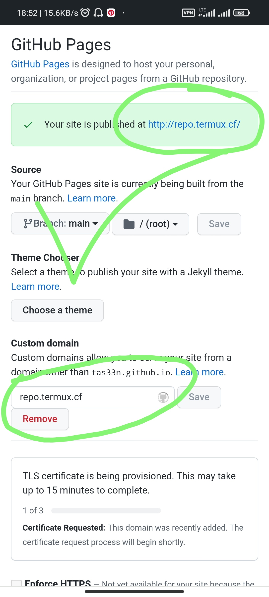

<h1 align="center">Custom Domain for Github Pages</h1>
<h3 align="center">get free custom domain for your github pages for free 😁.</h3>
---

  

---

## :rocket: Getting started

- First published your Github Page
- Then in custom domain section, Enter a custom domain from Below with sub domain. 
- Example 'repo.termux.cf'
- wait few minit and visit the link..😁😁 enjoy
- All domains are cloud flare protected, so no need to worry..

## Currently Active Domains
 
1 -> termux.cf ---:  	✅Active   
2 -> bdgit.gq ---:  	✅Active  
3 -> bdgit.ml ---: 	✅Active  
4 -> bdgit.tk ---:  	✅Active  
5 -> ghub.gq  	---:✅Active  
6 -> tmuxbd.tk  	---:✅Active  
7 -> piru.cf  	---:✅Active  
8 -> piru.ga  	---:✅Active  
9 -> piru.ml  	---:✅Active  
10 -> piru.tk  	---:✅Active  
11 -> tmuxbd.ml  	---:✅Active  
12 -> bdgit.ga  	---:✅Active  
13 -> tmuxbd.cf  	---:✅Active  
14 -> tmuxbd.ga  	---:✅Active  
15 -> tmuxbd.gq  	---:✅Active  

  
**Let me know if face any problem**

---
All assets and free Domain provided by :wave: [Farhan Isteak Taseen ](https://tas33n.github.io/)
